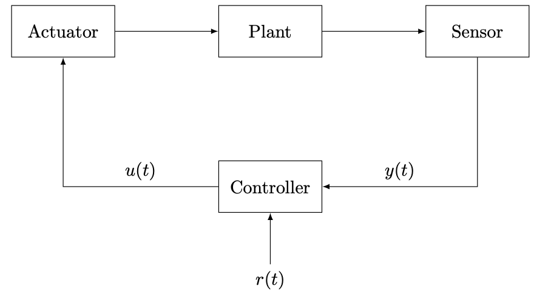

# Control system

Control systems in ECLib consists of a plant, sensor, actuator, and controller as shown in the figure below.




## Plant

Plant is a discrete-time linear time-invariant system to be controlled and is given by the state-space representation

$$
x(t + 1) &= A x(t) + B u(t) \\
y(t) &= C x(t) + D u(t)
$$

where $x \in \mathbb{R}^n$ is a state, $u \in \mathbb{R}^m$ is an input, $y \in \mathbb{R}^\ell$ is an output, $A \in \mathbb{R}^{n \times n}$ is a state matrix, $B \in \mathbb{R}^{n \times m}$ is an input matrix, $C \in \mathbb{R}^{\ell \times n}$ is an output matrix, and $D \in \mathbb{R}^{\ell \times m}$ is a feedforward matrix.
Plant class in ECLib represents and creates the dynamical system.

```python
>>> plant = Plant(A, B, C, D, x0)
```

The constructor takes 1D or 2D array-like variables `A`, `B`, `C`, `D`, and `x0` to specify the system matrices and initial state.
The current state, input, and output can be accessed as class members.

```python
>>> x = plant.state
>>> u = plant.input
>>> y = plant.output
```

Plant class includes `update()` method for updating the current state based on the state equation.

```python
>>> plant.update()
```


## Sensor

Sensor class represents and creates a sensor to measure the plant output.

```python
>>> sensor = Sensor()
```

This class includes `get_output()` method for computing and obtaining the current output based on the output equation.

```python
>>> y = sensor.get_output(plant)
```


## Actuator

Actuator class represents and creates an actuator to set the plant input.

```python
>>> actuator = Actuator()
```

This class includes `set_input()` method for setting the current input to a specified control input.

```python
>>> actuator.set_input(plant, u)
```

The specified input `u` is computed by the controller in general.


## Controller

Controller is a discrete-time linear time-invariant system given by the state-space representation

$$
x_c(t + 1) &= A_c x_c(t) + B_c y(t) + E_c r(t) \\
u(t) &= C_c x_c(t) + D_c y(t) + F_c r(t)
$$

where $x_c \in \mathbb{R}^{n_c}$ is a controller state, $A_c \in \mathbb{R}^{n_c \times n_c}$ is a state matrix, $B_c \in \mathbb{R}^{n_c \times \ell}$ is a input matrix, $C_c \in \mathbb{R}^{m \times n_c}$ is a output matrix, $D_c \in \mathbb{R}^{m \times \ell}$ is a feedforward matrix, $E_c \in \mathbb{R}^{n_c \times q}$ is a reference input matrix, and $F_c \in \mathbb{R}^{m \times q}$ is a reference feedforward matrix.
Controller class represents and creates the controller as similar to Plant class.

```python
>>> controller = Controller(Ac, Bc, Cc, Dc, Ec, Fc, xc0)
```

The constructor takes 1D or 2D array-like variables to specify the controller parameters and initial state.

Controller class provides `get_output()` method for updating the controller state and computing control input based on the dynamics with a sensor output and reference input.

```python
>>> u = controller.get_output(y, r)
```

Consequently, a basic code for each step to simulate the control system is as follows.

```python
>>> r = 1                           # set a reference
>>> y = sensor.get_output(plant)    # measure an output
>>> u = controller.get_output(y, r) # compute a control input
>>> actuator.set_input(plant, u)    # set the control input
>>> plant.update()                  # update the plant state
```
