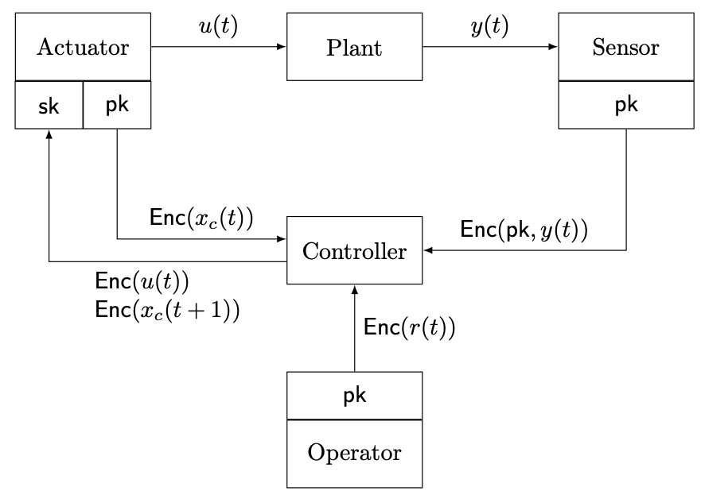

# Encrypted control system

To encrypt a controller using a homomorphic encryption scheme, it is reformulated as the matrix-vector product form.

$$
\begin{bmatrix}
x_c(t + 1) \\
u(t)
\end{bmatrix}
=
\begin{bmatrix}
A_c & B_c & E_c \\
C_c & D_c & F_c \\
\end{bmatrix}
\begin{bmatrix}
x_c(t) \\
y(t) \\
r(t)
\end{bmatrix}
$$

In this light, the controller takes the current controller state, plant output and reference as input and outputs the controller state update and control input.
With homomorphic operations, an encrypted controller computes the controller output vector over encrypted signals.
Encrypted control systems in ECLib are constructed as the figure shown below.




## Plant

The plant in encrypted control systems is the same as the [unencrypted case](./control_system.md).


## Sensor

The sensor in the figure is created with slight modifications to the unencrypted case.

```python
>>> scheme = "elgamal"
>>> sensor = Sensor(scheme, params, pk, s_enc)
```

In this example, the ElGamal encryption is supposed to be used.
The public key `pk` and scaling factor `s_enc` are used for encrypting the plant output.
Sensor class provides `get_enc_output` for the encryption process.

```python
>>> y_enc = sensor.get_enc_output(plant)
```


## Actuator

Similar to the sensor, the actuator is required some modifications.

```python
>>> actuator = Actuator(scheme, params, pk, sk, s_enc, s_dec)
```

The secret key `sk` and scaling factor `s_dec` are used for decrypting the controller output (i.e., controller state update and control input), and the public key `pk` and scaling factor `s_enc` are used for encrypting the controller state.
The decryption and re-encryption processes can be performed by `set_enc_input()` method and `re_enc_state()` method, respectively.

```python
>>> actuator.set_enc_input(plant, u_enc)
>>> xc_enc = actuator.re_enc_state(xc_enc)
```

Note that the reason why re-encrypting the controller state is to remove the accumulation of scaling factors in encrypted controller computation.
For more details, please see [[Kim23]](https://ieeexplore.ieee.org/document/9678042).


## Operator

Operator class represents and creates the operator who gives a reference input to the controller.

```python
>>> operator = Operator(scheme, params, pk, s_enc)
```

This class includes `get_enc_reference()` method for encrypting a reference with the public key `pk` and scaling factor `s_enc`.

```python
>>> r_enc = operator.get_enc_reference(r)
```


## Encrypted controller

EncryptedController class represents and creates the encrypted controller from an unencrypted controller.

```python
>>> enc_controler = EncryptedController(scheme, params, pk, controller, s_enc)
```

This class stores encrypted controller parameters as class members and provides `get_enc_output` method for computing the controller output vector without decryption.

```python
>>> xc_enc, u_enc = enc_controller.get_enc_output(y_enc, r_enc, xc_enc)
```

Consequently, a basic code for each step to simulate the encrypted control system is as follows.

```python
>>> r = 1                                               # set a reference
>>> r_enc = operator.get_enc_reference(r)               # encrypt the reference
>>> y_enc = sensor.get_enc_output(plant)                # measure an encrypted output
>>> xc_enc, u_enc = \
... enc_controller.get_enc_output(y_enc, r_enc, xc_enc) # compute an encrypted controller output
>>> actuator.set_enc_input(plant, u_enc)                # set the encrypted control input
>>> xc_enc = actuator.re_enc_state(xc_enc)              # re-encrypt the controller state
>>> plant.update()                                      # update the plant state
```
